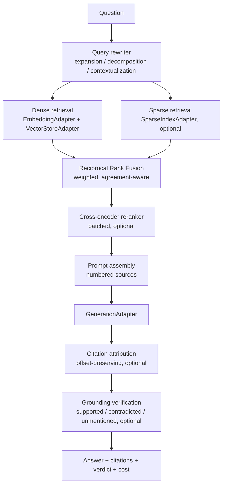

# rag-engine

> RAG pipeline for TypeScript: hybrid retrieval with rank fusion, cross-encoder reranking, query rewriting, citation attribution, and grounding verification that detects contradiction rather than just absence.

[](https://www.typescriptlang.org/)
[](https://nodejs.org/)
[](LICENSE)
[](#status)

> **Accuracy note.** Every example below is written against the exported API in
> [`src/index.ts`](src/index.ts). Anything designed but not built is listed under
> [Not implemented](#not-implemented) rather than shown as if it worked. No benchmark
> number appears anywhere in this repository, because none has been measured.

---

## Status

**Alpha, verified 2026-08-16.** The pipeline runs end to end with no external service:
`npx tsx examples/01-hello-world.ts` ingests, retrieves and answers using in-memory
adapters. No provider adapters for OpenAI, Qdrant or Anthropic ship with the package: you
implement four small interfaces, or copy the ones in [`examples/`](examples/).

---

## Problem

Naive RAG (embed everything, cosine similarity, stuff into the prompt) fails in four
specific ways. Each one has a mechanism here rather than a hope:

| Failure | Mechanism |
|---|---|
| Dense search misses exact terms. Ask for error code `E4021` and you get conceptually similar errors. | BM25 sparse retrieval fused by rank, so an exact token match cannot be diluted |
| Fixed-size chunking splits mid-thought | Recursive splitting down a separator hierarchy, paragraph before line before sentence |
| Top-k similarity is not top-k relevance | Cross-encoder reranking over the retrieved candidate set |
| The model states things absent from the sources | Claim-level verification that distinguishes *contradicted* from *unmentioned* |

The fourth is where most implementations stop at lexical overlap. Overlap alone rates a
direct contradiction as well-grounded, because *"the limit is 100"* and *"the limit is
**not** 100"* share every content word. This scorer treats polarity mismatch and numeric
mismatch as contradiction, and any contradiction forces review regardless of the aggregate
score.

---

## Install

```bash
npm install @q1-digital/rag-engine
```

Not published to npm yet. Clone and build locally: see [Development](#development).

---

## Quick start

This is [`examples/01-hello-world.ts`](examples/01-hello-world.ts), reduced. It runs with
no API key, because the adapters are in-memory.

```typescript
import { RAGEngine } from '@q1-digital/rag-engine';
import {
  HashingEmbedder,
  MemoryVectorStore,
  ExtractiveGenerator,
} from './examples/in-memory-adapters.js';

const engine = new RAGEngine({
  embedding: new HashingEmbedder(),
  vectorStore: new MemoryVectorStore(),
  generation: new ExtractiveGenerator(),
  chunking: { maxTokens: 40, overlap: 8 },
});

await engine.ingest([
  {
    content: 'The default rate limit is 1000 requests per minute per key.',
    metadata: { source: 'docs/rate-limits.md', title: 'Rate Limits' },
  },
]);

const result = await engine.query('What is the rate limit?');

console.log(result.answer);
console.log(result.metadata.inferenceCalls);  // cost is attributable per query
console.log(result.grounding);                // null when no scorer is configured

engine.dispose();  // releases the tiktoken encoder
```

```bash
npx tsx examples/01-hello-world.ts
```

**`result.grounding` is a discriminated union, not a number.** `{ verifiable: false,
reason: 'no_sources' }` and `{ verifiable: true, groundingScore: 0 }` are opposite
situations, and a bare `0` conflates "nothing to check" with "entirely fabricated".

---

## Adapters you implement

The library talks to four interfaces and constructs none of them. Provider names are not
configuration: a string cannot carry a credential, a base URL or a retry policy.

| Interface | Required | Method |
|---|---|---|
| `EmbeddingAdapter` | yes | `embed(texts: string[]): Promise<number[][]>` |
| `VectorStoreAdapter` | yes | `query(embedding, topK)`, `upsert(chunks)` |
| `GenerationAdapter` | yes | `complete(prompt: string): Promise<string>` |
| `SparseIndexAdapter` | no | `query(tokens, topK)`, optional `index(chunks)` |

Omitting the sparse index is a real trade-off, not a minor one: retrieval becomes
dense-only, so an error code or identifier retrieves conceptually similar documents instead
of the one that names it.

Working implementations of all four live in
[`examples/in-memory-adapters.ts`](examples/in-memory-adapters.ts). The BM25 index there is
genuine Okapi BM25; the embedder is deliberately lexical and says so.

**Consequence worth knowing:** this library reads no environment variables. Credentials
live in the adapters you build, so there is no `.env` surface here and no `.env.example` to
keep in sync.

---

## Pipeline



Every optional stage is genuinely optional. Without a reranker, retrieval order is used
directly. Without a scorer, `grounding` is `null` rather than a fabricated `1.0`.

When retrieval returns nothing, the engine **does not generate**. An answer produced from
zero sources has nothing grounding it, which is the failure this pipeline exists to prevent.

---

## Chunking

Two chunkers exist.

| Chunker | Mechanism | Cost |
|---|---|---|
| `RecursiveChunker` | Hierarchical separator splitting: paragraph, line, sentence, clause, word, character. Token-counted with tiktoken. | Free, no inference |
| `SemanticChunker` | Embeds sliding sentence windows and splits at similarity valleys | One embedding call per window |

`RAGEngine` uses `RecursiveChunker`. `SemanticChunker` is exported and usable directly, but
is not yet wired into the engine's ingest path.

```typescript
chunking: {
  maxTokens: 512,
  overlap: 64,
  separators: ['\n\n', '\n', '. ', ', ', ' ', ''],  // optional, this is the default
}
```

---

## Rank fusion

Dense and sparse rankings are fused by rank, not by score:

```
RRF(d) = SUM over systems i of   w_i / (k + rank_i(d))
```

`rank_i(d)` is 1-indexed, `w_i` is that retriever's weight, and `k` (default 60) dampens
low-ranked contributions.

**Why rank and not score.** Dense retrieval returns cosine similarities in `[-1,1]`; BM25
returns unbounded positive scores. Normalizing one against the other requires distribution
assumptions that break across corpora. Ranks are directly comparable with no normalization
at all.

Ties break on **agreement first**: a chunk both retrievers found outranks one a single
retriever ranked highly. `SearchResult.agreementCount` reports how many chunks both found,
and `SearchResult.degraded` names a retriever that failed, so a degraded result is
distinguishable from a genuinely thin one.

The BM25 implementation in the examples uses the Okapi formulation with `k1 = 1.2` and
`b = 0.75`:

```
score(D,Q) = SUM IDF(qi) * ( f(qi,D) * (k1 + 1) )
                         / ( f(qi,D) + k1 * (1 - b + b * |D|/avgdl) )

IDF(qi)    = ln( 1 + (N - n(qi) + 0.5) / (n(qi) + 0.5) )
```

The `0.5` smoothing and outer `1 +` are not decoration: without them a term appearing in
more than half the corpus produces a negative IDF, and a document containing it scores
*worse* than one that does not.

---

## Grounding verification

```typescript
hallucination: {
  enabled: true,
  threshold: 0.8,
  claimGranularity: 'sentence',   // 'atomic' requires a decompose function
  containmentThreshold: 0.6,
  entail: async (claim, source) => 'supported',  // optional: real NLI
}
```

Three verdicts per claim, not two:

| Verdict | Meaning |
|---|---|
| `supported` | The source contains the claim |
| `contradicted` | The source states the opposite, by polarity or by figure |
| `unmentioned` | The source is silent |

Contradiction is penalised beyond simply not counting as support, and **any** contradiction
forces at least `review`. A response can be 90% grounded and assert the opposite of a
source on the one claim that matters; averaging that away is how a confidently wrong answer
ships.

**The built-in verifier is lexical, and that is a real limitation.** It measures whether a
claim's vocabulary appears in the source, which is a proxy for entailment and not
entailment. It cannot detect a correct paraphrase that shares no vocabulary, and it cannot
verify a genuine logical inference. Supply `entail` for real NLI. The heuristic exists so
the pipeline degrades to something useful rather than to nothing.

Approach informed by the atomic-claim factuality literature: FActScore (Min et al., 2023)
and SAFE (Wei et al., 2024).

---

## Citations

```typescript
citations: {
  embed: (texts) => myEmbedder.embed(texts),
  citationThreshold: 0.65,
  maxCitationsPerSentence: 3,
}
```

Markers are assigned in order of first appearance, so `[1]` is the first citation in the
text and matches bibliography entry `1`. Formatting is preserved: markers are inserted into
the original string at recorded offsets rather than by rejoining split sentences, so
newlines, lists and code blocks survive.

`uncitedSentences` is reported with the best similarity found for each, because a sentence
without a citation is not automatically a problem. A transition has nothing to cite, and
distinguishing that from an unsupported assertion needs the list.

**Threshold direction matters.** Too low and every sentence gets a citation including the
fabricated ones, which is worse than no citations at all: it launders invention as sourced
fact. A missing citation is visible; a wrong one is not.

---

## Repository structure

Only what exists.

```
src/
├── core/
│   ├── config.ts                  # Adapter interfaces, domain types, RAGConfig
│   └── engine.ts                  # RAGEngine, RAGSession
├── ingestion/
│   └── chunkers/
│       ├── recursive.chunker.ts   # Separator hierarchy, tiktoken-counted
│       └── semantic.chunker.ts    # Embedding-boundary splitting
├── retrieval/
│   ├── hybrid-search.ts           # Dense + sparse, RRF, partial-failure degradation
│   ├── reranker.ts                # Batched cross-encoder scoring
│   └── query-rewriter.ts          # Expansion, decomposition, HyDE, contextualization
├── generation/
│   ├── citation-extractor.ts      # Offset-preserving attribution
│   └── hallucination-scorer.ts    # Claim verification with contradiction detection
└── index.ts

examples/
├── in-memory-adapters.ts          # Runnable adapters: hashing embedder, BM25, extractive generator
├── 01-hello-world.ts              # Minimum config
└── 02-full-pipeline.ts            # Every stage, plus contradiction detection
```

---

## Not implemented

Listed because a limitation found by a reader at 3 AM is worse than one written down.

| Gap | Consequence |
|---|---|
| **No provider adapters** | You implement `EmbeddingAdapter`, `VectorStoreAdapter` and `GenerationAdapter`, or copy from `examples/`. Nothing for OpenAI, Anthropic, Qdrant, Weaviate, Pinecone or pgvector ships here. |
| **No document parsers** | `ingest()` takes strings. PDF, DOCX and HTML parsing do not exist, and the dependencies that would have powered them were removed because nothing imported them. |
| **No metadata store** | Chunk metadata lives with the chunk in the vector store. There is no separate queryable store. |
| **`SemanticChunker` not wired into the engine** | Exported and usable directly; `RAGEngine` always uses `RecursiveChunker`. |
| **HyDE not reachable from `query()`** | `QueryRewriter.hyde()` is implemented and exported. The engine selects contextualization, decomposition or expansion, never HyDE. |
| **No test suite** | `npm test` runs vitest against zero test files. Nothing in `src/` is covered. |
| **No CI workflow** | `.github/` exists but contains no workflow, so nothing gates a merge. |
| **No benchmarks** | No measured numbers, anywhere. The metrics below are a measurement plan. |

---

## Evaluation plan

No results, only the intended methodology. Publishing a number here without a reproducible
run is the fastest way to lose a reader's trust.

| Metric | Measures |
|---|---|
| Recall@k | Retrieval coverage |
| MRR | How early the first relevant result appears |
| NDCG@k | Ranking quality with graded relevance |
| Grounding score | Faithfulness to sources |
| Citation precision | Whether a marker points at the passage that supports the sentence |

Intended datasets: MS MARCO, Natural Questions, HotpotQA.

---

## Design decisions

**Why containment instead of Jaccard for grounding.** Jaccard divides by the union, so a
12-token claim against a 400-token chunk caps near 0.03 and can never clear a 0.3
threshold. Every claim against a realistically sized source would read as unsupported.
Grounding asks what fraction of the *claim* appears in the source, which is asymmetric by
nature.

**Why the reranker filters on raw scores.** Min-max normalization maps the observed minimum
to 0 and maximum to 1, so a threshold on normalized scores always keeps roughly the top
fraction regardless of absolute relevance: five irrelevant candidates survive a set of ten
irrelevant ones. Normalization is presentation only, and `rawScore` is always returned.

**Why cross-encoder reranking rather than retrieving more.** A bi-encoder embeds query and
document independently and cannot model term interaction. A cross-encoder sees both, which
is also why it is too slow for a corpus and belongs over a candidate set.

**Why a partial retriever failure degrades instead of throwing.** A sparse index outage
should not fail a query dense retrieval alone can answer. `SearchResult.degraded` names the
casualty so the caller can tell degraded from thin.

---

## Development

```bash
git clone https://github.com/kreftamarcio/rag-engine.git
cd rag-engine
npm install

npm run typecheck   # tsc --noEmit, strict
npm run lint
npm run build       # emits dist/ from src/ only
npm test            # currently zero test files

npx tsx examples/01-hello-world.ts
npx tsx examples/02-full-pipeline.ts
```

`examples/` is outside the `tsconfig.json` include set, so `npm run typecheck` does not
cover it. Running the examples is the check for that directory.

---

## License

MIT. See [LICENSE](LICENSE).
