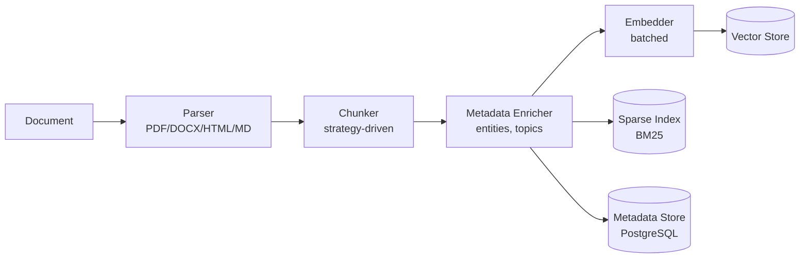
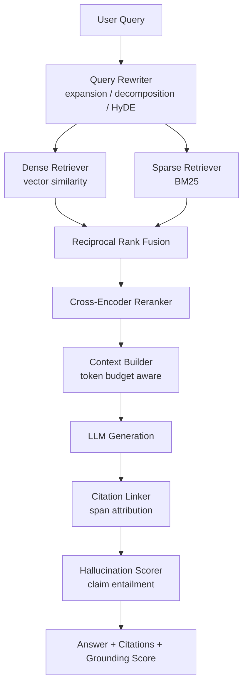

# rag-engine

> Production-grade Retrieval-Augmented Generation pipeline: hybrid search (dense + sparse), multi-strategy chunking, cross-encoder reranking, citation extraction, and hallucination scoring.

[](https://www.typescriptlang.org/)
[](https://nodejs.org/)
[](LICENSE)
[](#project-status)

## Project Status

**Work in progress.** Core orchestration, hybrid retrieval fusion, recursive chunking, and hallucination scoring are implemented. Vector store adapters and provider wiring are in development. **No benchmark numbers are published yet.** The Evaluation section documents the methodology used to measure quality, not results.

## Problem

Naive RAG (embed everything, cosine similarity, stuff into prompt) fails in production:

- **Semantic search misses exact terms.** Ask for error code `E4021` and dense retrieval returns conceptually similar errors, not that one.
- **Fixed-size chunking splits mid-thought.** A table gets cut in half, a function signature separated from its description.
- **Top-k similarity is not top-k relevance.** Embedding similarity is a weak proxy for answering the actual question.
- **No grounding verification.** The model confidently states things absent from the sources, and nothing catches it.

This engine addresses each failure mode with a specific mechanism: sparse retrieval for exact matches, semantic chunking for boundaries, cross-encoder reranking for true relevance, and claim-level entailment checking for grounding.

## Architecture

### Ingestion



### Retrieval and Generation



## Core Concepts

### Chunking Strategies

| Strategy | Mechanism | Best For |
|----------|-----------|----------|
| `recursive` | Hierarchical separator splitting (paragraph → line → sentence → word) | General prose, articles |
| `semantic` | Embedding-based topic boundary detection | Technical docs, mixed-topic pages |
| `sliding-window` | Fixed size with configurable overlap | Dense reference material |
| `sentence` | Sentence-group boundaries | FAQs, Q&A pairs |
| `parent-child` | Small chunks for matching, large parents for context | Hierarchical documentation |

### Reciprocal Rank Fusion

Hybrid search runs dense and sparse retrieval in parallel, then fuses the two rankings:

```
RRF_score(d) = Σ  w_i / (k + rank_i(d))
               i
```

Where `rank_i(d)` is the 1-indexed rank of document `d` in retrieval system `i`, `w_i` is that system's weight, and `k` (default 60) dampens the influence of low-ranked results.

**Why rank-based instead of score-based?** Dense retrieval returns cosine similarities in `[-1, 1]`; BM25 returns unbounded positive scores. Normalizing them against each other requires distribution assumptions that break across corpora. Ranks are directly comparable with zero normalization.

### BM25 Sparse Scoring

```
score(D,Q) = Σ IDF(qᵢ) · ( f(qᵢ,D) · (k₁ + 1) ) / ( f(qᵢ,D) + k₁ · (1 - b + b · |D|/avgdl) )
```

With `k₁ = 1.2` (term frequency saturation) and `b = 0.75` (length normalization). This is the Okapi BM25 formulation.

### Hallucination Scoring

Every generated response is decomposed and verified:

1. **Claim extraction** — split the response into atomic factual statements, filtering out questions, hedges, and meta-commentary.
2. **Entailment check** — for each claim, find the most relevant source chunk and test whether the source supports it.
3. **Grounding score** — ratio of supported claims to total claims.
4. **Decision** — `accept` above threshold, `review` in the grey zone, `reject` below.

Approach informed by the FActScore (Min et al., 2023) and SAFE (Wei et al., 2024) literature on atomic-claim factuality evaluation.

## Installation

```bash
npm install @q1-digital/rag-engine
```

## Quick Start

```typescript
import { RAGEngine } from '@q1-digital/rag-engine';

const rag = new RAGEngine({
  vectorStore: {
    provider: 'qdrant',
    url: process.env.QDRANT_URL!,
    collection: 'documents',
  },
  embedding: {
    provider: 'openai',
    model: 'text-embedding-3-large',
    dimensions: 3072,
  },
  chunking: {
    strategy: 'recursive',
    maxTokens: 512,
    overlap: 64,
  },
  reranker: {
    model: 'cross-encoder/ms-marco-MiniLM-L-12-v2',
    topK: 5,
  },
  generation: {
    provider: 'anthropic',
    model: 'claude-sonnet-4-20250514',
    maxTokens: 2048,
  },
  hallucination: {
    enabled: true,
    threshold: 0.85,
    claimGranularity: 'atomic',
  },
});

await rag.ingest([
  { content: '...', metadata: { source: 'docs/api.md', title: 'API Reference' } },
]);

const result = await rag.query('How do I authenticate with the API?');

console.log(result.answer);
console.log(result.citations);       // [{ source, span, relevance, chunkId }]
console.log(result.groundingScore);  // 0..1
console.log(result.metadata);        // queries used, chunks retrieved, latency
```

### Conversational Retrieval

```typescript
const session = rag.createSession();

await session.query('What is the rate limit?');
await session.query('How do I increase it?');
// Second query is rewritten to "How do I increase the API rate limit?"
// using conversation history before retrieval runs.
```

### Multi-Query Retrieval

```typescript
const result = await rag.query(
  'Compare REST and GraphQL authentication methods',
  { multiQuery: true, topK: 8 },
);
// Generates query variations, retrieves for each, deduplicates,
// then reranks the union against the original question.
```

## Configuration

```typescript
interface RAGConfig {
  vectorStore: {
    provider: 'qdrant' | 'weaviate' | 'pinecone' | 'pgvector';
    url: string;
    collection: string;
    apiKey?: string;
  };
  embedding: {
    provider: string;
    model: string;
    dimensions: number;
  };
  chunking: {
    strategy: 'recursive' | 'semantic' | 'sliding-window' | 'sentence' | 'parent-child';
    maxTokens: number;
    overlap?: number;
    separators?: string[];
  };
  reranker?: {
    model: string;
    topK: number;
    threshold?: number;
  };
  hallucination?: {
    enabled: boolean;
    threshold: number;
    claimGranularity?: 'sentence' | 'atomic';
  };
}
```

## Project Structure

```
src/
├── core/
│   ├── engine.ts                   # RAG orchestrator (ingest + query + session)
│   ├── config.ts                   # Zod configuration schemas
│   └── session.ts                  # Conversational state
├── ingestion/
│   ├── pipeline.ts                 # Ingestion orchestration + batching
│   ├── parsers/                    # PDF, DOCX, HTML, Markdown
│   ├── chunkers/
│   │   ├── recursive.chunker.ts     # Hierarchical separator splitting
│   │   ├── semantic.chunker.ts      # Embedding boundary detection
│   │   ├── sliding-window.chunker.ts
│   │   └── parent-child.chunker.ts
│   └── enrichers/                  # Entity + topic extraction
├── retrieval/
│   ├── hybrid-search.ts            # Dense + sparse orchestration
│   ├── dense.retriever.ts
│   ├── sparse.retriever.ts         # BM25
│   ├── fusion.ts                   # Reciprocal Rank Fusion
│   ├── reranker.ts                 # Cross-encoder reranking
│   └── query-rewriter.ts           # Expansion, decomposition, HyDE
├── generation/
│   ├── prompt-builder.ts           # Token-budget-aware context assembly
│   ├── citation-linker.ts          # Span-level source attribution
│   └── hallucination-scorer.ts     # Claim extraction + entailment
├── stores/
│   ├── vector/                     # Qdrant, Weaviate, Pinecone, pgvector
│   └── metadata/                   # PostgreSQL
└── index.ts
```

## Evaluation Methodology

The engine is designed to be evaluated against these metrics. **No results are published yet** — the benchmark harness is on the roadmap.

| Metric | Definition | Measures |
|--------|-----------|----------|
| Recall@k | Fraction of relevant documents present in top k | Retrieval coverage |
| MRR | Mean of `1/rank` of the first relevant result | How early the right answer appears |
| NDCG@k | Rank-discounted gain vs. ideal ordering | Ranking quality with graded relevance |
| Grounding Score | Supported claims / total claims | Factual faithfulness to sources |
| Citation Precision | Correct attributions / total attributions | Whether citations point to the right span |

Intended evaluation datasets: MS MARCO (passage ranking), Natural Questions (open-domain QA), HotpotQA (multi-hop reasoning).

## Design Decisions

**Why cross-encoder reranking instead of just retrieving more?** Bi-encoders embed query and document independently, so they can't model term interaction. A cross-encoder sees both together and scores actual relevance. It's too slow to run over a whole corpus, which is exactly why it runs over the retrieved candidate set.

**Why parent-child chunking?** Small chunks match precisely but lack context for generation. Large chunks give context but dilute the embedding. Parent-child gets both: match on the small child, feed the model the large parent.

**Why deduplicate before reranking?** Multi-query retrieval returns overlapping result sets. Reranking duplicates wastes cross-encoder compute, which is the most expensive step in the pipeline.

## Roadmap

- [ ] Vector store adapters (Qdrant, Weaviate, Pinecone, pgvector)
- [ ] Reproducible benchmark harness with published methodology and results
- [ ] Semantic chunker with embedding-based boundary detection
- [ ] Streaming generation with incremental citation resolution
- [ ] Multi-modal retrieval (tables, charts, images)
- [ ] Knowledge graph integration for entity-centric retrieval

## License

MIT
